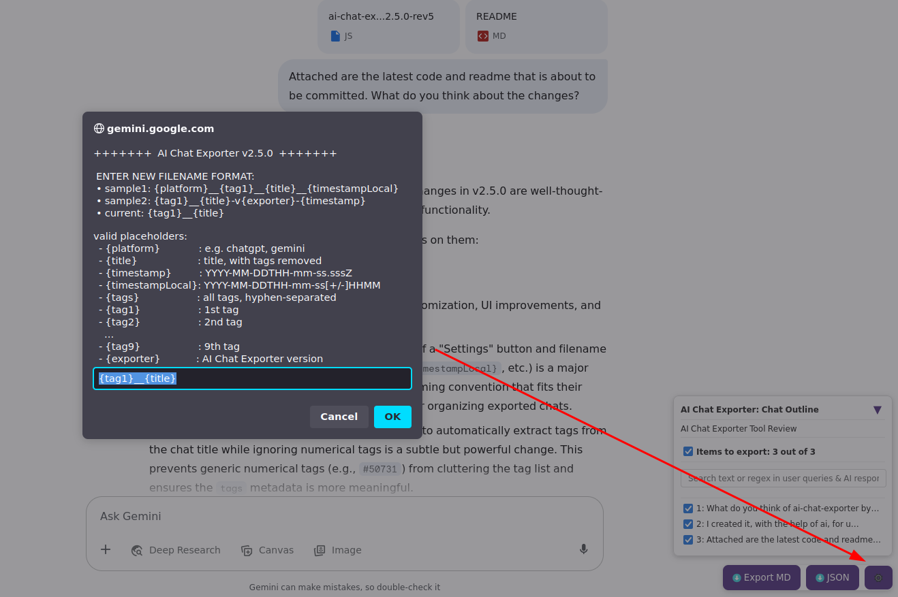
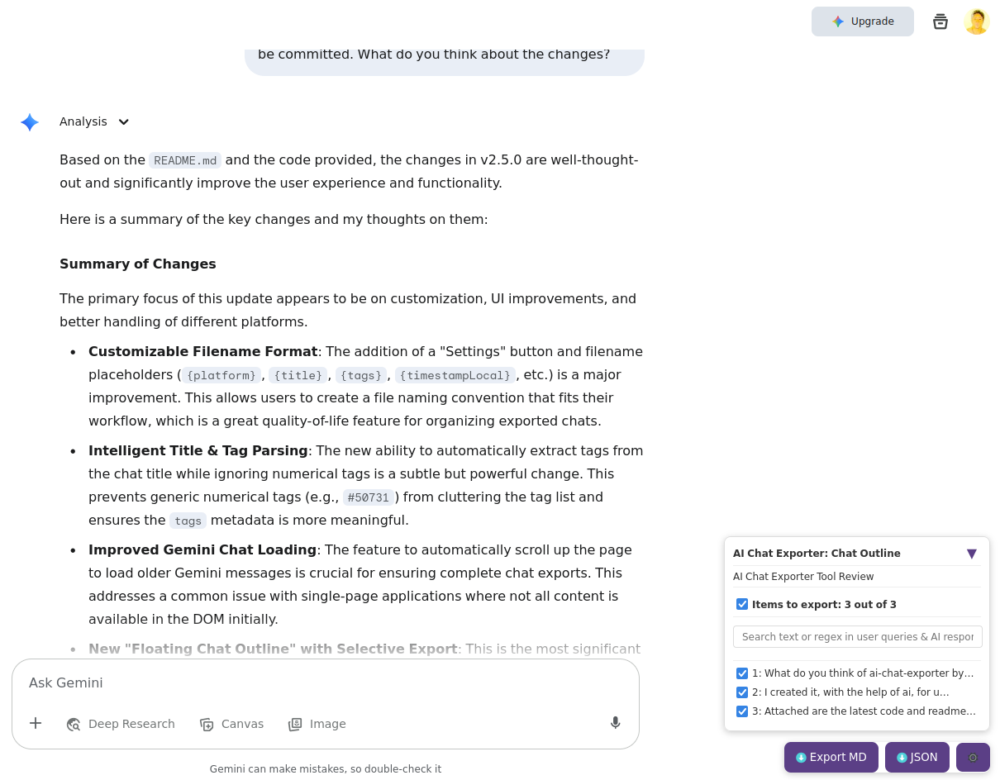
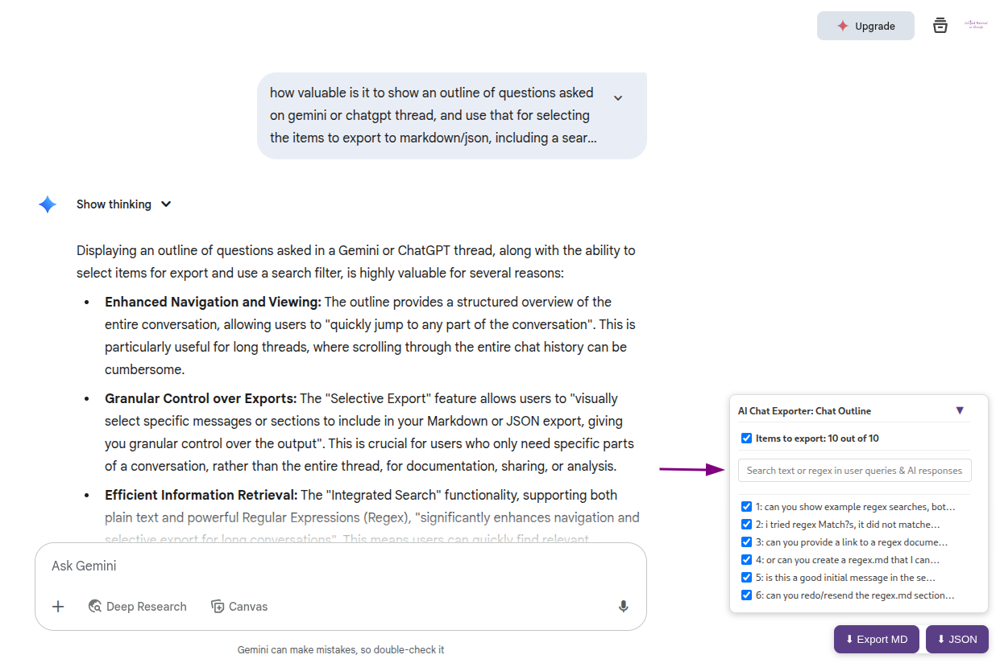

# ChatGPT-Claude-Copilot-Gemini AI Chat Exporter by RevivalStack (v2.7.0)

**ChatGPT-Claude-Copilot-Gemini AI Chat Exporter** is a Tampermonkey user script that allows you to export your conversations from **ChatGPT**, **Claude**, **Copilot**, and **Google Gemini** with rich Markdown formatting, a Table of Contents (TOC), YAML metadata, and more.


## What's New in v2.7.0?

This version focuses on enhancing cross-platform compatibility and providing a more consistent user experience.

- **Copilot Support**: Full support for exporting chats from Microsoft Copilot.
- **Consistent UI Theme**: The chat outline UI now consistently displays in a light theme, regardless of the host website's system theme. This ensures the search box and scrollbar are always visible and legible.
- **Improved JSON Export**: The JSON output now mirrors the Markdown export, with AI messages converted to Markdown and a more structured format, providing a consistent data model for programmatic use.

## What's New in v2.6.0?

This version introduces support for the Claude platform and includes several refinements.

- **Claude Support**: Full support for exporting chats from Claude.
- **Robust Code Block Handling**: A specialized `turndownService` rule has been implemented to correctly handle and format Claude's unique code block structure, ensuring the language label is properly included in the Markdown output.
- **Code Refactoring**: The code has been refactored for improved readability and maintainability.

## What's New in v2.5.0?

This version introduces significant enhancements focused on customization, output quality, and UI polish.

- **Customizable Filename Format**: A new "⚙️ Settings" button allows you to configure your preferred filename format using a variety of placeholders:
  - `{platform}`: The platform name (e.g., `chatgpt` or `gemini`).
  - `{title}`: The cleaned chat title.
  - `{timestamp}`: The ISO 8601 timestamp (UTC).
  - `{timestampLocal}`: The local timestamp with timezone offset.
  - `{tags}`: A hyphen-separated list of all tags found in the title.
  - `{tag1}` through `{tag9}`: Individual tags for more granular control.
    
- **Intelligent Title & Tag Parsing**: The script now automatically extracts tags (e.g., `#project-name`) from chat titles and cleans the title, while intelligently ignoring numeric tags (e.g., `#250731`) that are often used as dates. For example, you can name your chat as `#project #250731 #teamA Review of AI technologies`. This will produce a title `Review of AI technologies` and tags `[project, teamA]`.
- **Improved Gemini Chat Loading**: The exporter will automatically scroll up the page to load older gemini chat messages.

  

## Features

- **Cross-Platform Support**: Export conversations seamlessly from **ChatGPT**, **Claude**, **Copilot**, and **Google Gemini**.
- **Markdown Conversion**: Converts your chat conversation into a properly and elegantly formatted Markdown, ensuring accurate rendering of text, code blocks, tables, and especially **correct newlines within list items**.
  - **Table of Contents (TOC)**: Automatically generates a TOC linking to each message pair (user question + AI response) within the Markdown export.
  - **Back to Top**: Allows quick navigation through a "Back to Top" link after each AI response in the Markdown export.
  - **YAML Front Matter**: Includes comprehensive metadata like thread name, message count, exporter version, export timestamp, and the original chat thread URL.
- **JSON Export**: Option to export conversations as a structured JSON file, including message IDs, authors, and content.
- **Export Button**: A floating "Export Chat" button for easy downloading of the conversation as a `.md` or `.json` file.
- **Floating Chat Outline with Selective Export**: A new, collapsible floating panel that provides an outline of all questions and responses in the conversation. This allows for:

  - **Easy Viewing & Navigation**: Quickly jump to any part of the conversation.
  - **Selective Export**: Visually select specific messages or sections to include in your Markdown or JSON export, giving you granular control over the output.
  - **Integrated Search**: Search for specific text or regular expressions (Regex) within user queries and AI responses. This significantly enhances navigation and selective export for long conversations. For a detailed guide on using regex, refer to the [Regex Search Guide](regex.md).

    

- **Turndown Integration**: Safely converts HTML content into Markdown using a customized [Turndown](https://github.com/mixmark-io/turndown) service.
- **Local Time Formatting**: Includes the exact local time when the conversation was exported.

## Installation

### via Tampermonkey

1.  Install **Tampermonkey** from the [official website](https://www.tampermonkey.net/).

    - [Chrome](https://chrome.google.com/webstore/detail/tampermonkey/dhdgffkkebhmkfjojejmpbldmpobfkfo)
    - [Firefox](https://addons.mozilla.org/firefox/addon/tampermonkey)
    - [Edge](https://microsoftedge.microsoft.com/addons/detail/tampermonkey/iikmkjmpaadaobahmlepeloendndfphd)

2.  Create a new script in Tampermonkey and paste the code from this repository, or click below to install directly:

    [Install UserScript (ai-chat-exporter.user.js)](https://raw.githubusercontent.com/revivalstack/chatgpt-exporter/refs/heads/main/ai-chat-exporter.user.js)

3.  Navigate to any ChatGPT, Claude, Copilot, or Google Gemini conversation page.
4.  A floating "⬇ Export MD" and "⬇ JSON" button will appear at the bottom right of the page.
5.  Click the desired button to download your conversation.

### via Greasy Fork

- [Greasy Fork script](https://greasyfork.org/en/scripts/541051-chatgpt-gemini-ai-chat-exporter-by-revivalstack)

## Export Format

The Markdown export includes:

1.  **YAML Front Matter** with thread metadata.
2.  **Table of Contents** linking to each user question and AI response pair.
3.  **Markdown Content** of the conversation, including formatted messages, code blocks, and links.

[Sample Export](sample.md):

```yaml
---
title: Chat with ChatGPT
tags: [testchat, docs]
author: chatgpt
count: 3
exporter: 2.5.0
date: 2025-07-31T17-47-00+0800
url: https://chatgpt.com/c/...
---
# Chat with ChatGPT

## Table of Contents

- [1: How does GPT-4 work?](#chat-1)
- [2: Can GPT-4 answer any question?](#chat-2)
- [3: what's your chatgpt version](#chat-3)

### chat-1

> How does GPT-4 work?

###### AI said:

GPT-4 works by using a transformer-based architecture that processes and generates text based on large datasets.

### chat-2

> Can GPT-4 answer any question?

###### AI said:

GPT-4 can answer a variety of questions, though it may not always provide perfect responses.

### chat-3

> what's your chatgpt version

###### AI said:

You're currently chatting with **AI using GPT-4o**, which is the latest and most advanced model as of June 2025.

...
```

## License

MIT License. See [LICENSE](https://github.com/revivalstack/ai-chat-exporter/blob/main/LICENSE) for more information.

## Author

[**Mic Mejia**](https://github.com/micmejia)

_This was created with the assistance of chatgpt and google gemini._

---

For issues or suggestions, please create an issue or submit a pull request on [GitHub](https://github.com/revivalstack/ai-chat-exporter).
